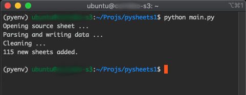
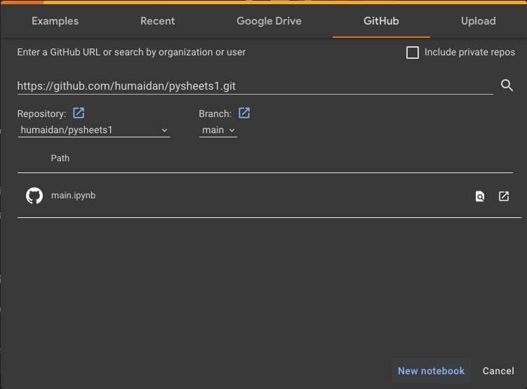
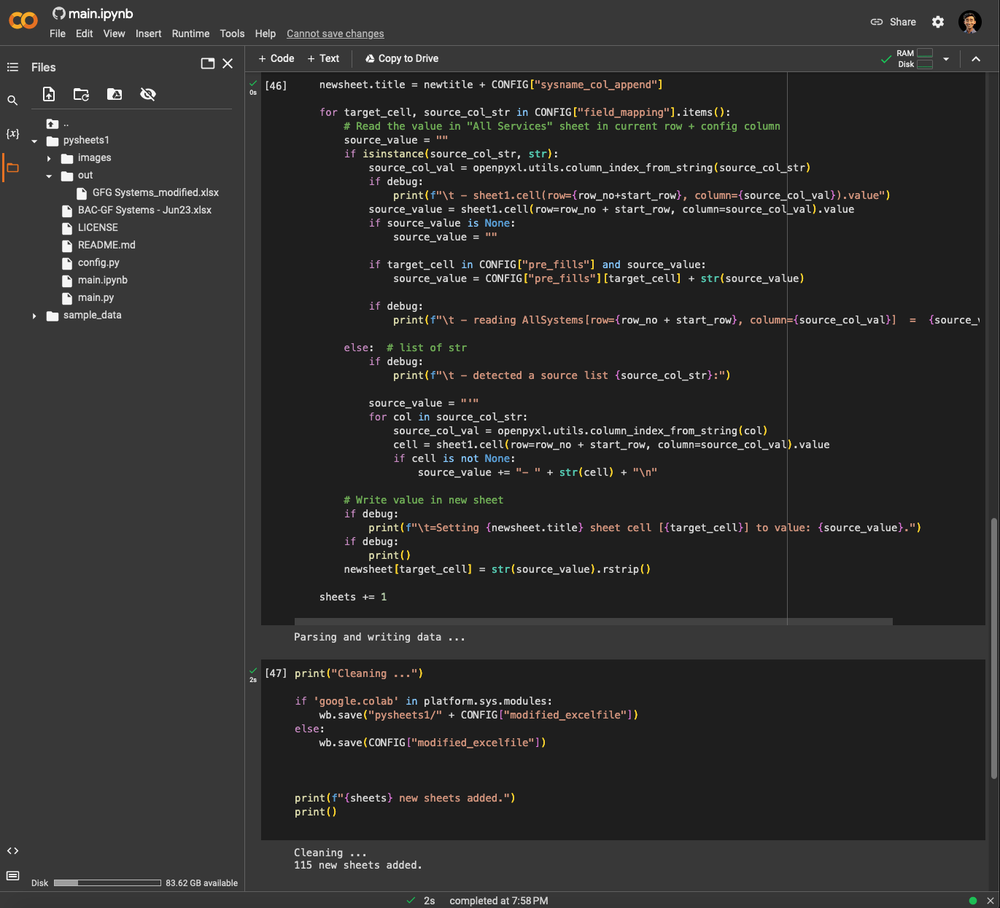
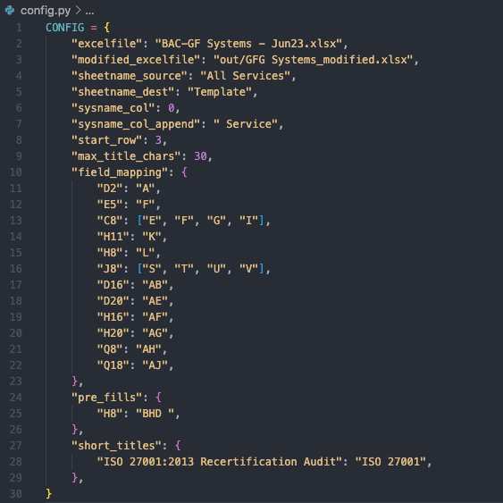

# Project Title

Python Excel Sheets Extractor

## Project Description

The Python Excel Data Extractor is a script that reads data from a source Excel sheet and maps specific fields to different locations in a destination Excel sheet. It automates the process of transferring data between sheets based on a predefined mapping while creating new sheets from a certain Template Sheet.

## Run Instructions

-   Before running the script you have to place your excel file in root folder of the project
    (read Configuration section for full setup)

To run the app if you have your own python environment, do the followings:

```bash
(py-env) ubuntu@srv$ python main.py
```



if you know what you're doing you can run it with Google Colab(https://colab.research.google.com/) or nbviewer.org(https://nbviewer.org/). **Otherwise you probably <span style="color: red;">_shouldn't_</span> be touching this repo or reading this file.**

1. Go to https://colab.research.google.com/.
2. Click on the "GitHub" tab.
3. Enter the URL of the Git repository & press Tab selecting humaidan/pysheets1 | main branch:
   https://github.com/humaidan/pysheets1.git
4. Select main.ipynb file from the repository
   
5. Click on  of main.ipynb
6. The notebook will open in Google Colab, and you'll be able to execute the code cells and interact with the notebook's content.
7. Place your excel in main folder (check config.py) and the output file will be in out folder
8. from Runtime menu -> Run all & confirm any warning
9. Download your out file
   

## Configuration

You can modify the following variables in the `config.py` file:

```
    - excelfile: excel file path and name
    - modified_excelfile: new file path and name
    - sheetname_source: source sheet to read data from
    - sheetname_dest: template sheet to copy and write data in
    - sysname_col: system name to name the new sheet created
    - sysname_col_append: appending the previous name
    - start_row: number of row where the content of the table starts
    - max_title_chars: max allowed characters for sheet name [excel limitation is 30]
    - field_mapping: dictonary in the form of destination cell informat of A# as a key and value of corresponding column names in source sheet
    - pre_fills: dictionary to pre-fill a certain field in the above field_mapping dict
    - short_titles: rename a sheet name if found in this dict
```



## Contributing

Contributions are welcome! If you find any issues or have suggestions for enhancements, please submit a pull request or open an issue in the repository.

## License

This project is licensed under the MIT License.

## Authors

    Ali Humaidan (@humaidan)
